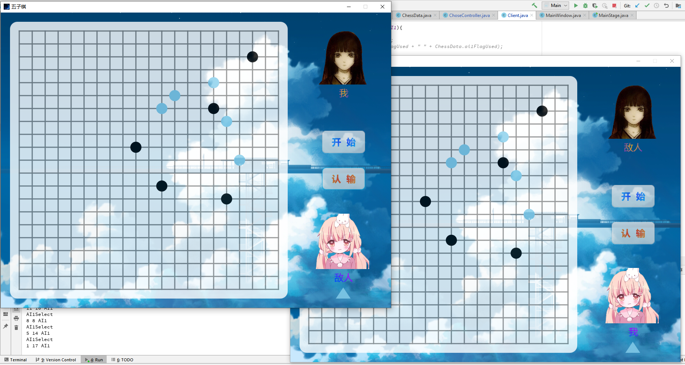
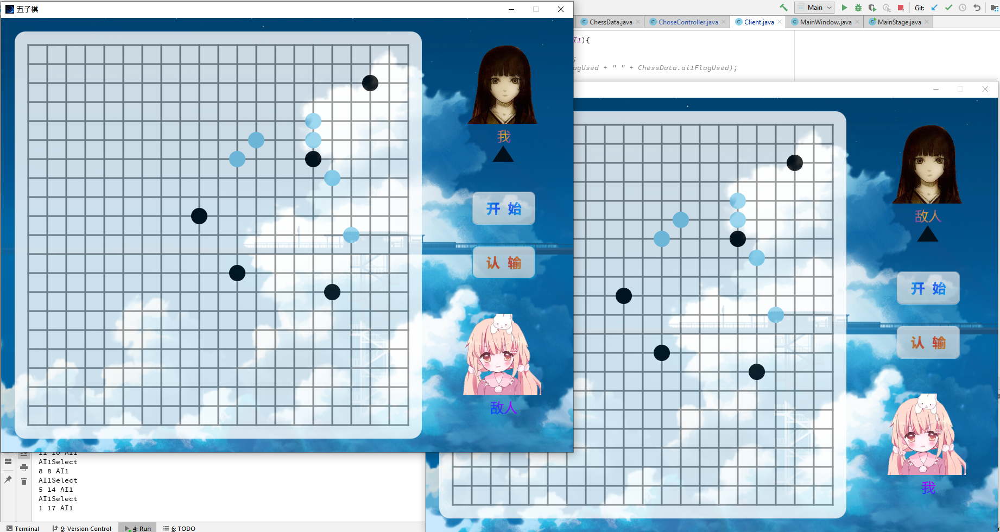
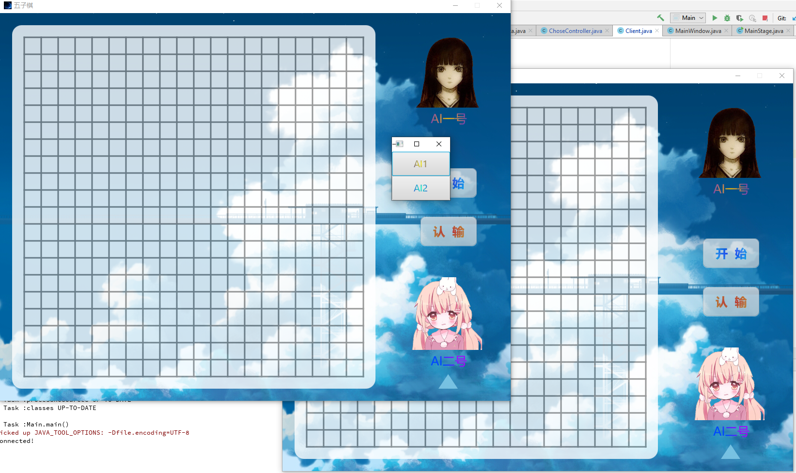
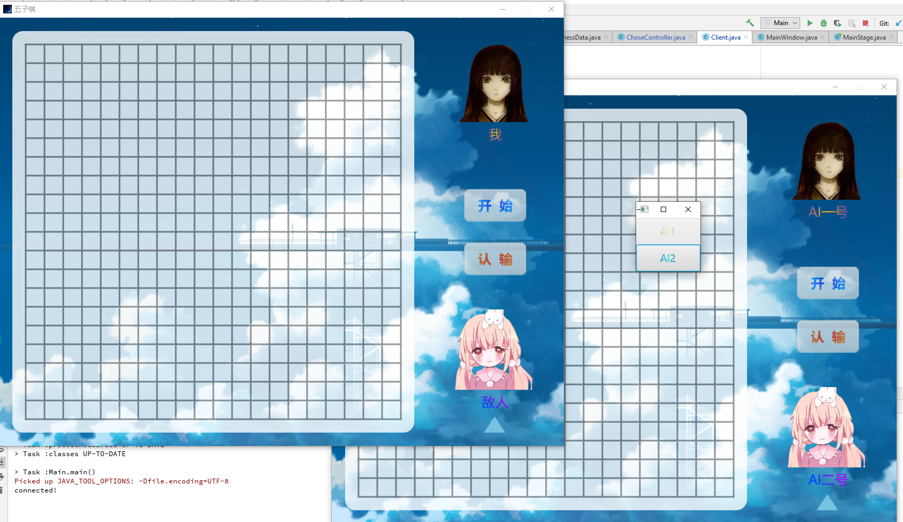
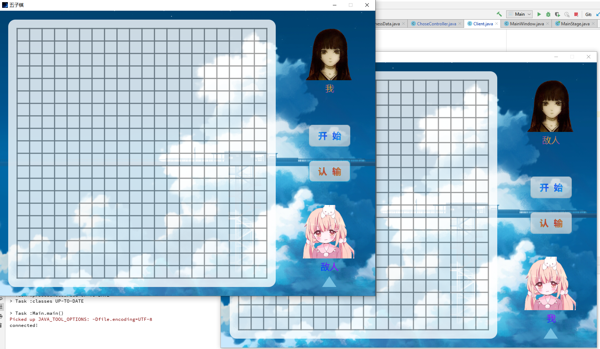
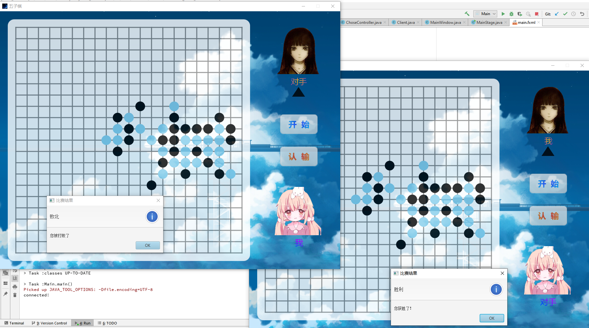
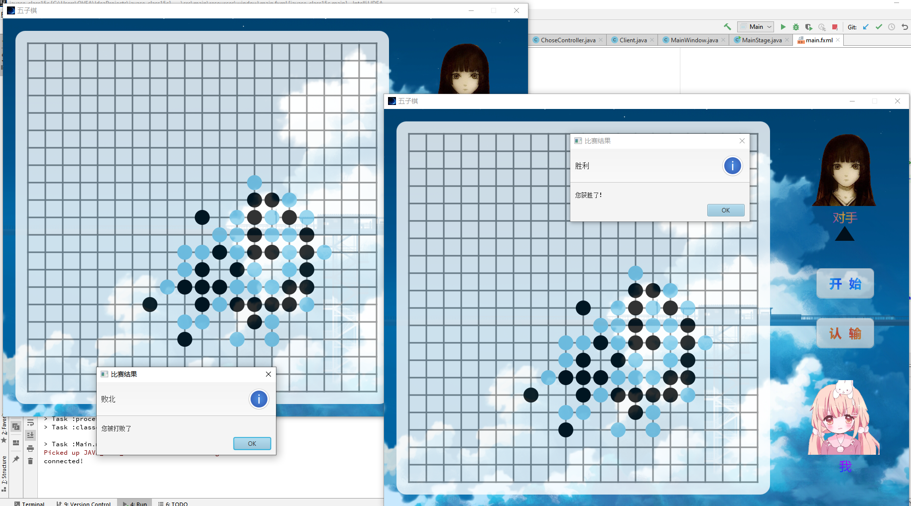
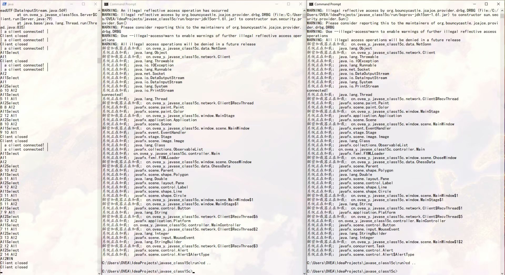

# Simple GoBang

>  Play a game of Gobang on the Internet

### Describe

​	·	I finish this little game use a day, this is my class assignment.

​	·	Use OpenJFX to build the gobang client ui.

​	·	client_encryption_version is build a decryption classloader to  run it.

### Development Environment

​	·	**Gradle 5.4.1**

​	·	**Java 12**

### Result

-----------

>  playing process

> playing process

> select role

> select role

> start play!

> game result

> game result

> decryption and server running process

